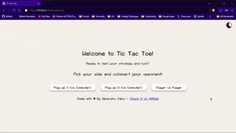
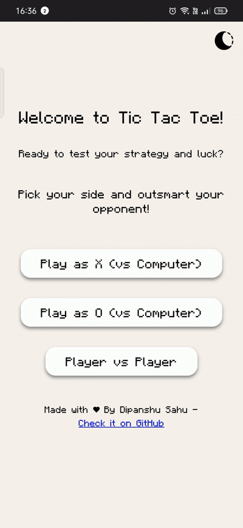

# 🎮 Tic Tac Toe 

Welcome to my Tic Tac Toe game! This project is a simple yet engaging game built using HTML, CSS, and JavaScript. It offers various modes to enjoy, including a challenging computer opponent and a seamless player vs player experience.

## 🌟 Features

- 🎮 Player vs Player Mode: Play with a friend on the same device.

- 🤖 Player vs Computer: Test your skills against a computer opponent with random moves.

- 🌗 Dark & Light Mode: Toggle between dark and light themes.

- 🔄 Restart Button: Restart the game anytime.

- ⏳ Loading Screen: Adds a smooth transition with a dynamic loading effect.

- 🎵 Sound Effects: Enjoy click sounds and victory sounds for a better gaming experience.

- 📱 Responsive Design: Play on any device, from desktops to mobile phones.

## 🚀 My Journey 

This project took me around 6 days to complete. I started with a basic player vs player mode and gradually expanded the game. Implementing the computer player logic was a particularly fun challenge. Along the way, I also learned a lot about:

- Writing efficient JavaScript logic.

- Improving UI/UX with smooth transitions.

- Adding audio for a better gaming experience.

- Implementing light/dark mode themes.

- Creating a responsive design using CSS.

It was a fantastic learning experience, and I’m proud of how it turned out!


## 🛠️ Technologies Used 

- **HTML** for the structure

- **CSS** for the styling and responsiveness

- **JavaScript** for the game logic and interactivity

## Project Showcase

### Desktop Preview



### Mobile Preview

<div style="text-align:center;">
    
</div>

## 🕹️ How to Play 

1. Clone the repository:

    ```bash
    git clone https://github.com/dipanshu447/TicTacToe-Game.git
    ```
2. Navigate to the project folder:

    ```bash
    cd Tic-Tac-Toe
    ```

3. Open the index.html file in your browser.

4. Choose your game mode and start playing!

## 📜 License 

This project is licensed under the **MIT License**. You are free to use, modify, and distribute it with proper attribution.

For more details, see the [LICENSE](LICENSE) file.

## 💬 Feedback

Feel free to contribute or report issues. Suggestions are always welcome!

**Enjoy the game!**